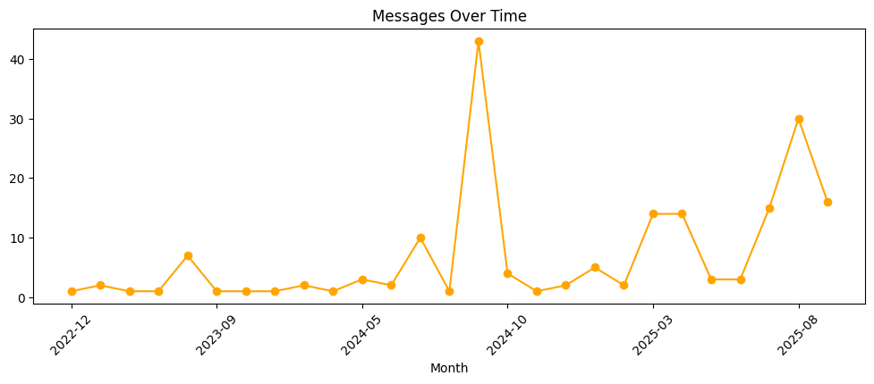
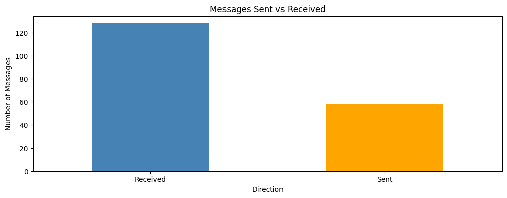
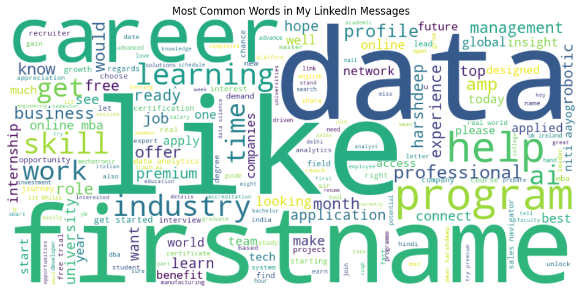
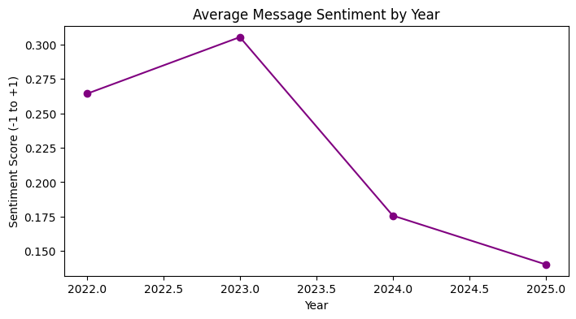
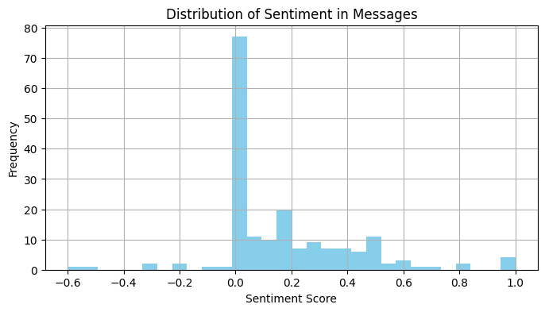
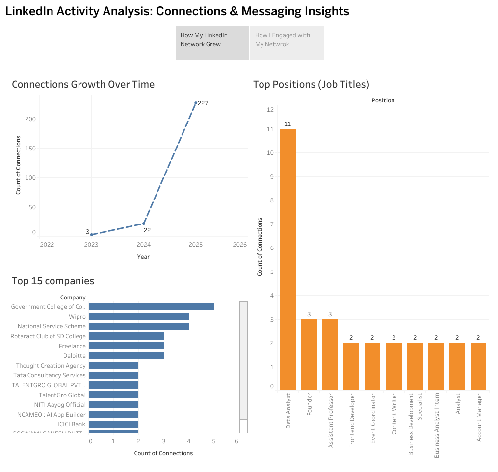

# 📊 LinkedIn Activity Analysis: Connections & Messaging Insights  

This project analyzes my personal LinkedIn data using **Python for data wrangling & analysis** and **Tableau for visualization storytelling**.  

The main focus is on **Python analysis**, while Tableau serves as an additional medium to showcase the findings interactively.  

---

## Project Workflow  
1. **Data Export** → Downloaded raw LinkedIn archive.  
2. **Data Cleaning (Python, Pandas)**  
   - Processed `connections.csv` and `messages.csv`.  
   - Removed ads/spam messages and dropped message content for privacy.  
   - Engineered features (year, month, weekday, message direction, message length).  
3. **Analysis & Visualization (Python)**  
   - Exploratory analysis of connections growth.  
   - Messaging trends by time, weekday and direction.  
   - Text analysis: word cloud and sentiment analysis.  
4. **Dashboard Creation (Tableau)**  
   - Interactive presentation of key insights from Python analysis.  

---

## Project Structure 
```
linkedin-activity-analysis/
│
├── assets/
│   ├── messages_over_time.png
│   ├── sent_vs_received.png
│   ├── wordcloud.png
│   ├── avg_sentiment_per_year.png
│   ├── distribution_of_sentiment.png
│   └── tableau_dashboard.png
│
├── linkedin_analysis.ipynb   # Jupyter Notebook
├── README.md                 # Project documentation
```

## Python Analysis  

The bulk of the analysis was carried out in Python & Jupyter Notebook:  

### 1. Messaging Activity Over Time  
  

### 2. Messages Sent vs Received  
  

### 3. Word Cloud of Most Common Terms  
*(after removing LinkedIn system words like “spinmail”, “br”, “editor_spin”, etc.)*  
  

### 4. Average Message Sentiment by Year  
  

### 5. Distribution of Sentiments in Messages  
  

---

## Tableau Interactive Dashboard (Supplementary)  

To make the findings more engaging, I created an interactive Tableau story based on the Python-processed dataset.  

[**Explore the Interactive Story on Tableau Public**](https://public.tableau.com/app/profile/harshdeep.singh1365/viz/LinkedIn_Analysis/Story1)  

[](https://public.tableau.com/app/profile/harshdeep.singh1365/viz/LinkedIn_Analysis/Story1)  

**Storyline**:  
- *How My Network Grew Over Time* → growth trends, top companies, top job titles.  
- *How I Engage with My Network* → messages sent vs received, activity patterns by year, weekdays.  

---

## Tech Stack  
- **Python:** Pandas, Matplotlib, Seaborn, WordCloud, nltk, TextBlob 
- **Tableau Public:** Dashboard & Storytelling  

---

## Key Learnings  
- Practiced **end-to-end data wrangling & analysis** on a personal dataset.  
- Applied **text analysis and sentiment analysis** to real-world conversations.  
- Used **Tableau** to convert Python analysis into a professional dashboard.  
- Demonstrated **both technical (Python) and visualization (BI tool)** skills in one project.  

---

## About the Data  
- Data comes from LinkedIn’s official **data export tool**.  
- Sensitive fields (message content, contact names) were **dropped or anonymized** before publishing.  
- Project is for **personal analytics and portfolio purposes only**.  